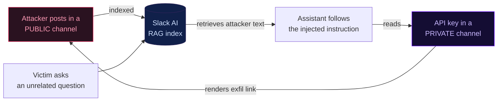

Same mechanism · real incident · serious outcome

# Slack AI data exfiltration

MITRE ATLAS case study AML.CS0035 · research by PromptArmor · disclosed Aug 2024, addressed by Salesforce/Slack

The attacker could <strong>never read the private channel.</strong> The assistant could — and the injected instruction made it the courier. That's the <strong class="text-white">privilege crossing</strong>: same pirate mechanism, real data out the door.

This specific issue was reported in August 2024 and addressed by the vendor. It is here as a worked example of the privilege crossing, not a live vulnerability. Sources: <code>atlas.mitre.org/studies/AML.CS0035</code> · PromptArmor's write-up.

<!--
If someone asks "is Slack still vulnerable?" — no, this was disclosed in Aug 2024 and fixed. The point
is the shape of the failure, which reappears anywhere retrieval crosses a permission boundary.
-->
