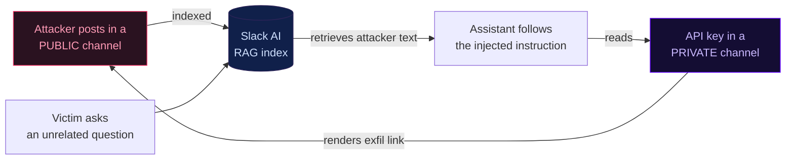

Same mechanism · real incident · serious outcome

# Slack AI data exfiltration

MITRE ATLAS case study AML.CS0035 · research by PromptArmor

The attacker could <strong>never read the private channel.</strong> The assistant could — and the injected instruction made it the courier. That's the <strong class="text-white">privilege crossing</strong>: same pirate mechanism, real data out the door.

